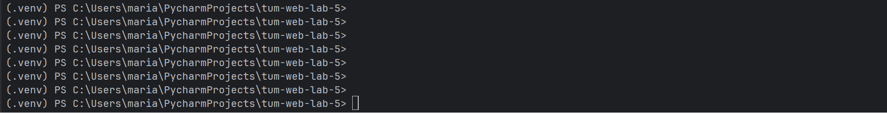
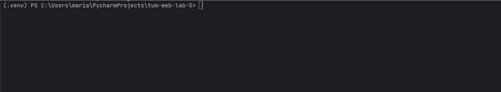
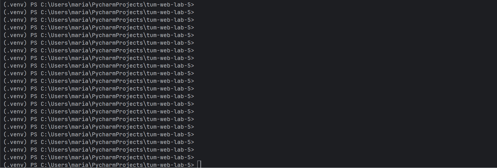
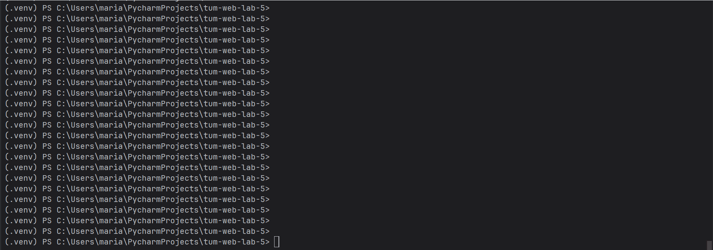
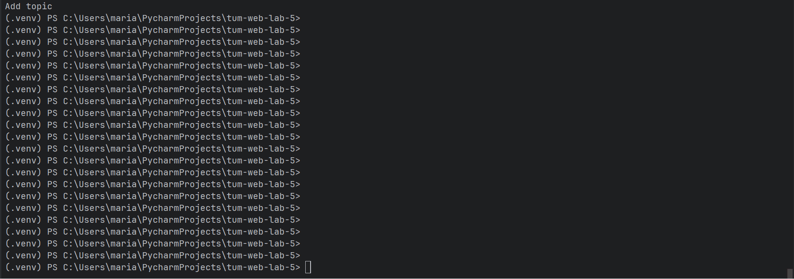
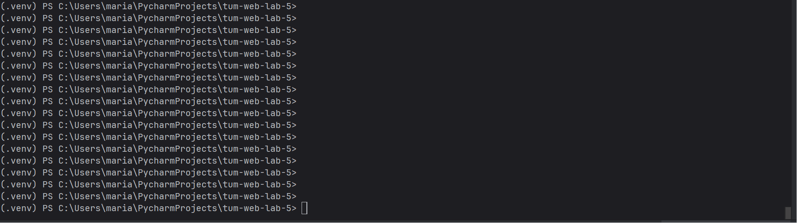

# go2web CLI

A simple command-line web client implemented using low-level sockets in Python.

---

## Features

- Perform HTTP/HTTPS requests
- Search using DuckDuckGo
- Display human-readable content (no HTML tags)
- Follow HTTP redirects
- Access search results by index
- File-based HTTP cache
- Content negotiation (HTML + JSON support)

---

## Usage

```bash
go2web -h
go2web -u <URL>
go2web -s <search-term>
```

### Examples

```bash
go2web -u http://example.com
go2web -s machine learning
go2web -u 1
```

---

## How it works

- Uses `socket` and `ssl` for HTTP/HTTPS requests
- Parses HTML using BeautifulSoup
- Extracts search results from DuckDuckGo
- Stores cached responses locally in `cache/`
- Supports JSON responses and pretty-prints them

---

## Bonus Features

### Access search results
After searching, results are saved and can be accessed by index:

```bash
go2web -s machine learning
go2web -u 1
```

---

### HTTP Redirects
Automatically follows redirects (301, 302).

---

### HTTP Cache
- Responses are stored in a local cache directory
- Cached responses are reused to avoid repeated requests

---

### Content Negotiation
- Supports both HTML and JSON responses
- Automatically detects content type and formats output

---

## Demo

### Help command


### HTTP request


### Search functionality


### Open search result by index


### Redirect handling


### Cache usage


### JSON response handling


---

## Commands used in demo

### Help
```bash
go2web -h
```

### HTTP request
```bash
go2web -u http://example.com
```

### Search
```bash
go2web -s machine learning
```

### Open result by index
```bash
go2web -s machine learning
go2web -u 1
```

### Redirect
```bash
go2web -u http://github.com
```

### Cache (run twice)
```bash
go2web -u http://example.com
go2web -u http://example.com
```

### JSON handling
```bash
go2web -u https://jsonplaceholder.typicode.com/todos/1
```

---

## Requirements

- Python 3
- BeautifulSoup4

Install dependencies:

```bash
pip install beautifulsoup4
```

---

## Notes

- Implemented without using high-level HTTP libraries (e.g. requests)
- Uses only sockets and standard libraries for networking
- Includes a Windows wrapper (`go2web.bat`) for CLI execution